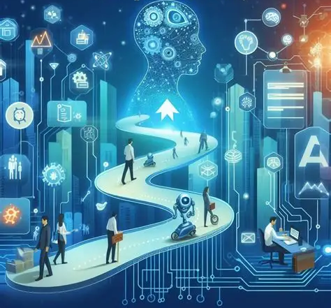
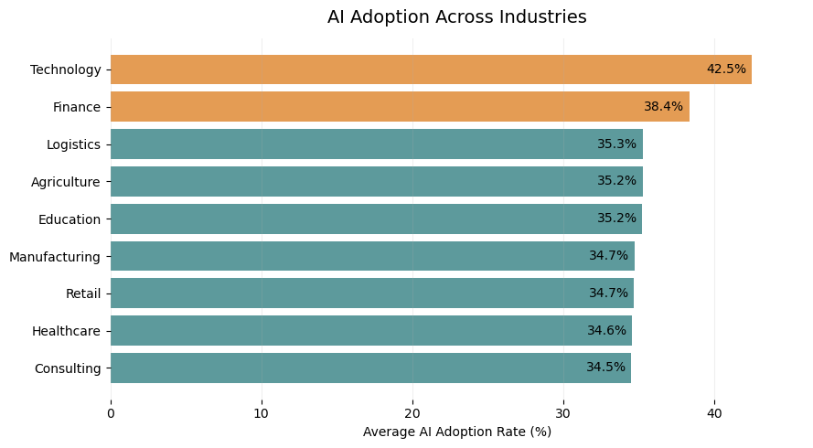
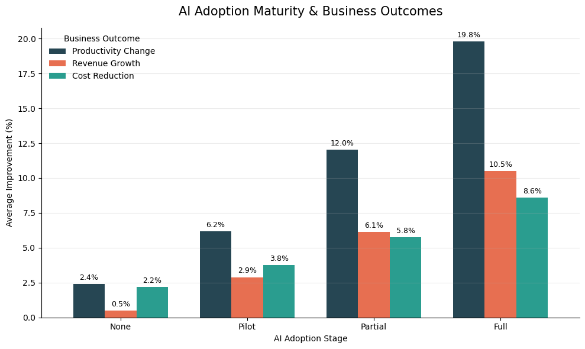
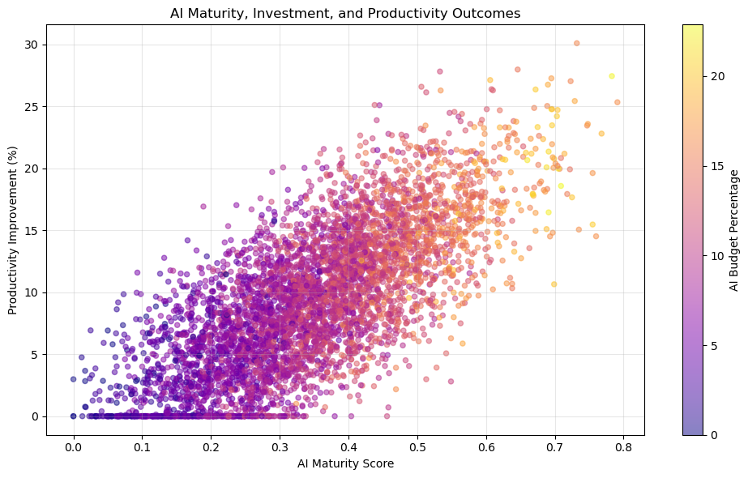
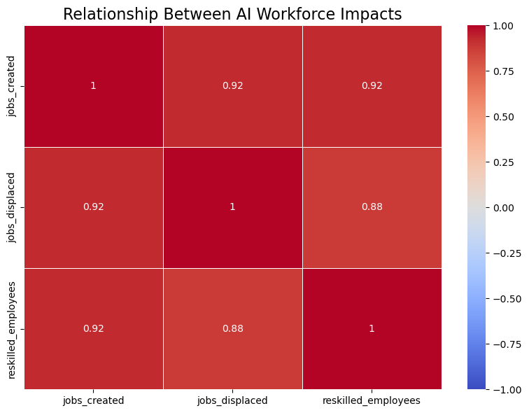
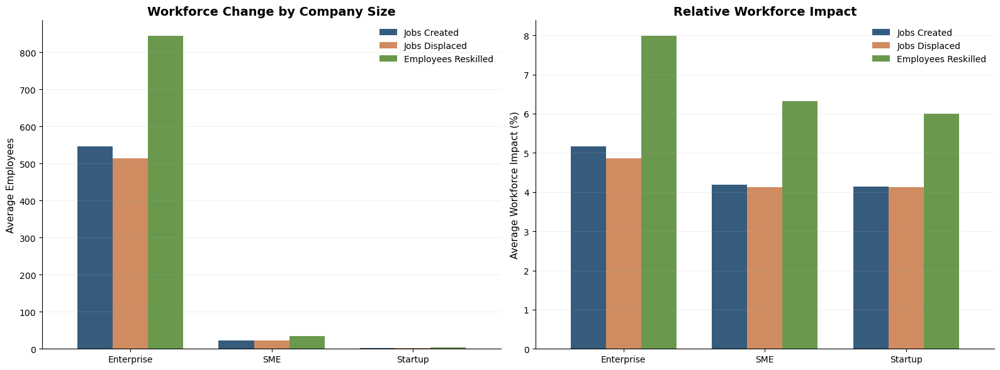

<h1 align="center"> Global AI Adoption & Workforce Impact Analysis</h1>

  An analysis of AI maturity, business outcomes, and workforce transformation

  

## Project Overview 

Organizations are rapidly adopting Artificial Intelligence (AI), but adoption alone does not show whether AI is creating meaningful improvements. Organizations also need to understand how AI maturity relates to business outcomes, workforce changes, and the challenges involved with integrating new technology.

Using the Global AI Adoption & Workforce Impact Dataset from Kaggle, this project explores relationships between AI maturity, investment, workforce impacts, and organizational outcomes using Python-based data analysis and visualization techniques.

The goal of this project was to identify trends and relationships within the data. Since this is an exploratory analysis, findings show associations rather than direct cause-and-effect relationships.

## Motivation

In my current role as an Operations Research Analyst supporting digital transformation efforts, I help evaluate opportunities for automation and improved data use across organizational processes. This study allowed me to explore similar questions at a broader scale using a public dataset.

This dataset does not represent my workplace, but many of the themes reflect common digital transformation challenges: identifying valuable automation opportunities, measuring effectiveness, managing adoption risk, and understanding workforce impacts.

## Table of Contents
1. [Dataset Description](#dataset-description)
2. [Questions Explored](#questions-explored)
3. [Tools and Technologies](#tools-and-technologies)
4. [Analytical Approach](#analytical-approach)
5. [Data Preparation](#data-preparation)
6. [Exploratory Data Analysis](#exploratory-data-analysis)
7. [Findings](#findings)
8. [Future Research](#future-research)

## Dataset Description

The dataset contains company, industry, and country-level information related to AI adoption and workforce impact. The data is a synthetic dataset modeled after real-world enterprise analytic datasets.   
Dataset Source: [Global AI Adoption & Workforce Impact Dataset - Kaggle](https://www.kaggle.com/datasets/mohankrishnathalla/global-ai-adoption-and-workforce-impact-dataset)

Key areas covered include:

- AI adoption stage and maturity
- AI investment levels
- Automation rates
- Workforce changes
- Productivity impacts
- AI governance practices
- Company characteristics
- Country digital maturity indicators

Data Considerations:

Because the dataset is synthetic, the results should be interpreted as an analytical exercise rather than conclusions about actual companies. The analysis focuses on identifying patterns, exploring relationships, and practicing data-driven evaluation methods.

## Questions Explored

This analysis is focused on questions related to AI adoption and digital transformation:

1. How does AI adoption vary across industries and regions? [Findings](#1-ai-adoption-landscape) plotly: [Global AI adoption](https://s-shockley.github.io/MidtermAIAdoption/Images/global_ai_adoption_map.html) 
2. Are higher levels of AI maturity associated with stronger organizational outcomes? [Findings](#2-ai-maturiy-and-business-outcomes)
3. How does AI adoption impact workforce composition? [Findings](#3-workforce-transformation-analysis)
4. Are workforce changes primarily related to displacement, creation, or transformation? [Findings](#3-workforce-transformation-analysis)

## Tools and Technologies

- Python
- Pandas
- Matplotlib
- Plotly
- Jupyter Notebook
- Git/GitHub

## Analytical Approach

### Data Preparation 
[Data Prep Notebook](Notebooks/Cleaning.ipynb)
- Import CSV data
- Reviewed table relationships
- Evaluated missing values
- Validated data types
-Prepared data for analysis and visualization

### Exploratory Data Analysis
- Summary statistics  
[Landscape Notebook](Notebooks/Landscape.ipynb)
- Industry comparisons 
- Country-level comparisons  
[Business Value Notebook](Notebooks/AIBusinessValue.ipynb) 
- AI maturity evaluation  
[Workforce Impact Notebook](Notebooks/WorkForceRestructure.ipynb)
- Workforce impact analysis
- Correlation analysis between AI factors and outcomes

  <a href="#top">⬆ Back to Top</a>

# Findings

### 1. AI Adoption Landscape

The first step was understanding where AI adoption was occurring before evaluating outcomes.

AI adoption showed a broad global footprint with differences across industries and regions. Technology and Finance had the highest average adoption rates, while other industries showed varying levels of implementation.

This provided context for later analysis by showing that AI adoption is not occurring equally across all sectors.  
[Global AI adoption](https://s-shockley.github.io/MidtermAIAdoption/Images/global_ai_adoption_map.html)  
  

### 2. AI Maturity and Business Outcomes
The next analysis explored whether higher levels of AI maturity were associated with measurable improvements in organizational performance.

Companies with higher AI maturity showed stronger outcomes across:

Productivity improvement
Revenue growth
Cost reduction

**Correlation analysis** showed a strong positive relationship between AI maturity and productivity improvement.

> **Statistics Note:**  
> Correlation analysis was used to measure the strength and direction of relationships between variables.  
>
> **Correlation coefficient (r):** Values range from -1 to +1 and indicate how strongly two variables move together. Values closer to +1 represent a stronger positive relationship.  
>
> **P-value (p):** Measures whether the observed relationship is statistically significant. In this analysis, p-values below 0.05 were considered statistically significant.  
>
> Correlation identifies relationships between variables but does not prove that one variable causes another.

  

However, this relationship does not prove that AI maturity alone caused improved outcomes. Other factors (scatter plot), such as company size, available resources, or existing technical capabilities, may influence both AI adoption maturity and business performance.  

  <a href="#top">⬆ Back to Top</a>

### 3. Workforce Transformation Analysis

Initial correlation analysis identified a strong relationship between AI-related workforce variables. Jobs created, jobs displaced, and employees reskilled all showed strong positive relationships, meaning these workforce changes frequently occurred together within the dataset.  
  
  
  

<b>Figure:</b> AI workforce changes before and after normalizing by company size.

At first glance, this suggested that AI adoption may be associated with workforce transformation rather than only workforce reduction. Companies reporting higher job displacement also tended to report higher job creation and employee reskilling.

Further analysis showed that company size was an important factor. Larger organizations naturally experienced greater workforce movement because they had larger employee populations.

To account for this, workforce changes were normalized as a percentage of total employees.

After adjusting for company size:

Reskilling remained the largest workforce impact category across Enterprise, SME, and Startup organizations
Job creation and displacement occurred at similar rates
Net workforce change remained relatively balanced across company sizes

These findings suggest that within this dataset, AI adoption was associated more strongly with workforce restructuring and employee transition than broad workforce reduction.

  <a href="#top">⬆ Back to Top</a>

## Future Research

Add analysis on what other factors are impacting results and how companies can take advantage!

